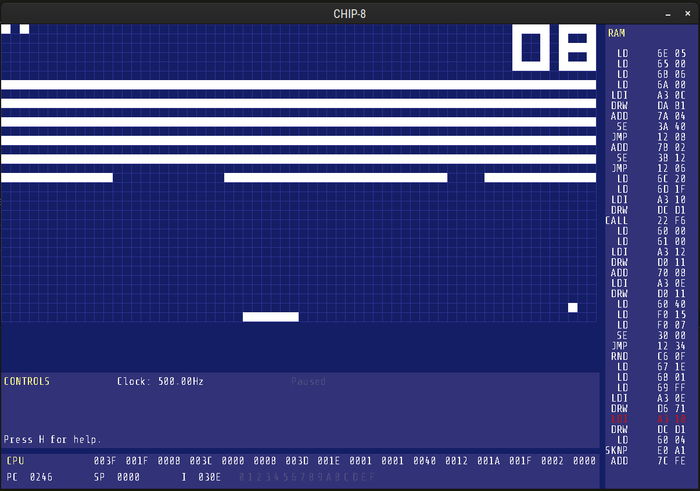

# CHIP-8 Emulator
This is a chip-8 emulator, it's almost done. This is my second try doing this, this time I went for a _niceish_ GUI.

# TODO
- Sound.
- Go back to previous states.
- Reset and load roms from the GUI.
